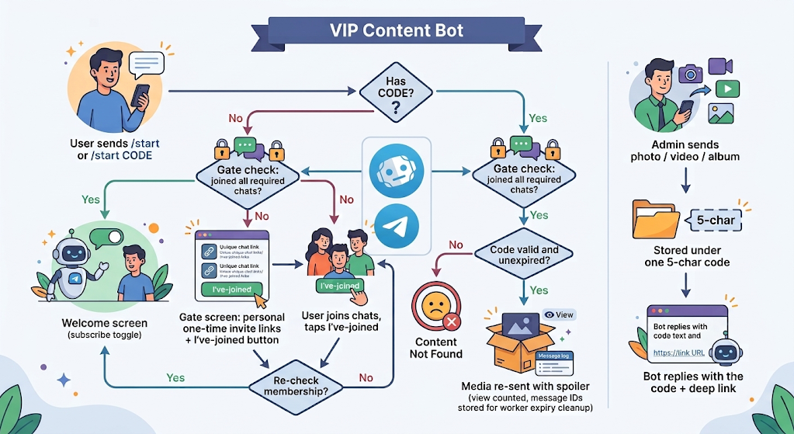

  

  <h1>VIP Content Bot</h1>

  
A production Telegram bot built with <a href="https://github.com/gramstax/gramstax">Gramstax</a> — admins upload premium media behind short-lived access codes, users redeem them via deep links, and a join-gate + admin panel control the whole operation.

  

    
    
    
    
    
    
  

  

> **Closed source.** This repo is the public showcase — README, configuration
> template, and license. The full source is licensed separately (see
> [Get the bot](#-get-the-bot)).

## ✨ Features

### For users

- 🎟️ **Redeem by code** — `/start A7KQ2` or deep link `https://t.me/<bot>?start=A7KQ2`
- 🖼️ **Media preserved** — photos, videos, and media groups arrive exactly as uploaded
- 🚪 **Join gate** — access can require joining partner chats first (auto-checked, expiring invite links)
- 🌍 **Bilingual messages** — English + Indonesian variants
- ❌ **Clear failures** — invalid/expired codes get an explicit `Content Not Found` reply; banned users are silently ignored on every entry point

### For admins (`BOT_ADMIN_IDS` only)

- 📤 **Upload anything** — single photo/video or mixed media groups → one 5-char code (`A7KQ2`)
- 🔑 **Unique codes** — collision-checked against the DB, atomic claim (no double-issue)
- ⏱️ **Auto-expiry** — codes die after `CONTENT_EXPIRY_MS` (default 60s); a worker deletes the evidence messages
- 📊 **Admin panel** — content browser (list/detail/popular/failed), user directory with search + pagination + country stats, subscriber/ban management
- 📣 **Broadcast** — push a message to all subscribers with a completion report (target/sent/failed)
- ⛔ **Ban/unban** — per-user bans enforced on every entry point
- ⚙️ **Settings** — gate config, expiry tuning, and bot info, editable in-chat

### Platform

- 🧩 **Page-based routing** — every screen is a class with `show`/`process` steps, inline keyboards, session state
- 💾 **LMDB persistence** — 9 typed schemas, keyset pagination, sync transactions, O(1) counts
- ⚙️ **Background worker** — expiry cleanup + broadcast fan-out run in a worker thread (30s+ tasks never block polling)
- 🔌 **Self-healing polling** — drops reconnect with exponential backoff (1s→60s, `pollingMaxRetries` budget, `-1` = forever), pending updates preserved across retries, so a network blip never needs a manual restart or a separate runner
- 🛡️ **Graceful shutdown** — `SIGINT`/`SIGTERM` drain the worker, stop timers, and close the DB
- ✅ **E2E tested** — in-process harness asserts every Telegram API call (`e2e/` mirrors `src/pages/`)

## 🤖 Live demo

Try the fan flow right now — no install, just Telegram:

1. Open [SECURITY_DATA](https://t.me/YOUR_DEMO_BOT) _(replace with your demo bot)_
2. Send `/start DEMO1` (or tap the deep link the demo bot shows)
3. Pass the gate if one is configured, receive the media under spoiler

<!-- TODO(owner): point the link above at a real demo bot before publishing. -->

## 💰 Pricing

One-time commercial license per bot instance:

- Full source code + configuration template (all 30 options)
- Setup guidance for polling, webhook, or serverless deploys
- Full configuration reference for all 30 options

Final price and payment terms are agreed directly — no storefront cut, no subscription.

## 🚀 Get the bot

VIP Content Bot is commercial, closed-source software:

- 💬 Telegram: [damar](https://t.me/damartripamungkas) _(replace with your username)_

You receive the full source, the full configuration reference, and setup guidance.

## ❓ FAQ

**Is the source code included?**
No — this repo is the showcase. The full source is licensed separately (see [Get the bot](#-get-the-bot)).

**What do I need to run it?**
[Bun](https://bun.sh), a VPS or any always-on machine, and a bot token from [@BotFather](https://t.me/BotFather). No database server to operate — storage is embedded, backups are built in.

**Polling or webhook?**
Both, plus serverless adapters. Polling fits most creator bots; webhooks fit high-traffic ones. It is one environment variable either way.

**Do fans need to join my channel first?**
Only if you configure the join gate. Promote the bot to admin, tap Add, and it mints personal one-time invite links by itself. No gate configured means codes work instantly.

**What happens when a code expires?**
It stops redeeming and the worker deletes every delivered copy it can reach, then reports leftovers in your admin panel.

**Can I ban someone?**
Yes — per-user bans from the admin panel, enforced silently on every entry point.

**Which languages do fans see?**
English and Indonesian, picked automatically from the fan's Telegram language.

**Are my backups safe?**
Snapshots run on schedule with retention, optionally uploaded to any S3-compatible storage (R2, AWS, MinIO) with verified PUTs. Upload failures never delete the local file.

## 📄 License

Proprietary — see [LICENSE](./LICENSE).
