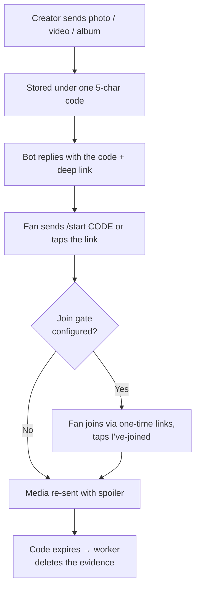

  

  <h1>VIP Content Bot</h1>

  
A production Telegram bot for creators — drop exclusive media for fans behind auto-expiring access codes: upload once, share a 5-char code, it vanishes on timeout.

  

    
    
    
    
    
  

  

> **Closed source.** This repo is the public showcase — README, configuration
> template, and license. The full source is licensed separately (see
> [Get the bot](#-get-the-bot)).

## ✨ Showcase

### For fans

- 🎟️ **Redeem by code** — `/start A7KQ2` or a deep link like `https://t.me/<bot>?start=A7KQ2`
- 🖼️ **Media arrives intact** — photos, videos, and mixed albums land exactly as uploaded, under spoiler
- 🚪 **Join gate** — creators can require joining partner chats first; checks are automatic and links are personal one-time invites
- 🌍 **Bilingual** — English + Indonesian messages
- ❌ **Clear failures** — invalid or expired codes get an explicit reply instead of silence

### For creators

- 📤 **Upload anything** — one photo, video, or album → one 5-char code (`A7KQ2`)
- ⏱️ **Auto-expiry** — codes die on your schedule (default 60s); a background worker wipes the evidence messages
- 📊 **Admin panel** — content browser with views and popular charts, searchable user directory with country stats, subscriber and ban management — all inside Telegram, no dashboard to host
- 📣 **Broadcast** — push a message to every subscriber with a sent/failed report
- ⚙️ **Tunable in-chat** — expiry, cleanup cadence, and gate links adjustable without restarts or redeploys

### Platform

- 🔌 **Self-healing polling** — drops reconnect with exponential backoff and no lost updates, so a network blip never needs a manual restart
- 💾 **Embedded database** — no Postgres/Redis to operate; backups are scheduled snapshots with S3-compatible upload
- 🛡️ **Graceful shutdown** — workers drain, timers stop, the database closes cleanly
- 🧪 **E2E tested** — every user journey is asserted end to end before release

## 🔍 How it works

1. **Creator drops media** in a chat with the bot (only admins — everyone else is silently ignored).
2. The bot replies with a **5-char code + deep link**, e.g. `A7KQ2`.
3. **Fans redeem** via `/start A7KQ2` or the link. If a join gate is configured, they join the required chats first through personal one-time invite links.
4. Media arrives under spoiler, the view is counted, and when the code expires the **worker deletes every trace**.

### Join gate without hand-editing config

Promote the bot to admin in any group/channel and it asks the admins (right inside Telegram) whether to gate on it. Accept, and it mints the invite links, writes the config itself, and keeps the links rotated forever. Demote it and the chat drops off the gate automatically.

## 🚀 Get the bot

VIP Content Bot is commercial, closed-source software:

- 💬 Telegram: [SECURITY_DATA](https://t.me/YOUR_USERNAME) _(replace with your username)_
- 📧 Email: [SECURITY_DATA] _(replace with your email)_

<!-- TODO(owner): put the real contact above before publishing. -->

You receive the full source, the `.env.example` in this repo (all 30 options), and setup guidance for polling, webhook, or serverless deploys.

## 🔧 Configuration preview

Everything is tuned through environment variables (see [`.env.example`](./.env.example) for all options with defaults):

| Variable             | What it does                                  |
| :------------------- | :-------------------------------------------- |
| `TELEGRAM_BOT_TOKEN` | Bot token from [@BotFather](https://t.me/BotFather) (required) |
| `TELEGRAM_BOT_DEPLOY`| `polling` · `webhook:<public-url>` · `serverless:<adapter>` |
| `BOT_ADMIN_IDS`      | JSON array of admin Telegram user IDs (required) |
| `CONTENT_EXPIRY_MS`  | Code lifetime, default 60s                    |
| `BACKUP_ENABLED`     | Scheduled snapshots, off by default           |
| `BACKUP_S3_*`        | Optional upload to R2 / S3 / MinIO            |

Gate chats, invite links, and backups can additionally be managed from inside Telegram itself — no restarts, no redeploys.

## 🚢 Deployment

- **Development** — `TELEGRAM_BOT_DEPLOY=polling` with file watching.
- **Production (webhook)** — point `TELEGRAM_BOT_DEPLOY` at a public URL behind a process manager (`systemd`, `pm2`).
- **Serverless** — adapters for Lambda / Cloudflare Workers style runtimes.
- **Backup** — scheduled live snapshots (single-file `tar.gz` or raw dir) with retention, plus verified upload to S3-compatible storage.
- **Logs** — stdout by default with optional rotating log files.

## 🩺 Troubleshooting

| Symptom | Likely cause | Fix |
| :------ | :----------- | :-- |
| `401 Unauthorized` on startup | Bad/revoked token | Regenerate at [@BotFather](https://t.me/BotFather) |
| `409 Conflict` (`terminated by other getUpdates`) | Two instances polling with the same token | Run exactly one; check for stale processes |
| Bot ignores your media | Your ID is not in `BOT_ADMIN_IDS` | Add it (JSON array of numbers, not strings) |
| Codes expire instantly | `CONTENT_EXPIRY_MS` too low or clock skew | Raise the value; check system time |
| Gate links invalid | Invite TTL elapsed or bot lost admin rights | Re-check admin rights; tune the TTL |

## 🧰 Tech Stack

- [Gramstax](https://github.com/gramstax/gramstax) `2.x` — declarative Telegram bot framework
- [@gramstax/lmdb](https://www.npmjs.com/package/@gramstax/lmdb) `2.x` — typed embedded database
- [@gramstax/worker-thread](https://www.npmjs.com/package/@gramstax/worker-thread) `2.x` — worker lifecycle + RPC
- [Bun](https://bun.sh) — runtime, test runner, and bundler
- [@aws-sdk/client-s3](https://www.npmjs.com/package/@aws-sdk/client-s3) `^3` — S3-compatible backup upload
- TypeScript in strict mode

## 📚 Learn More

- [Gramstax Documentation](https://github.com/gramstax/gramstax)
- [Telegram Bot API](https://core.telegram.org/bots/api)

## 📄 License

Proprietary — see [LICENSE](./LICENSE).
